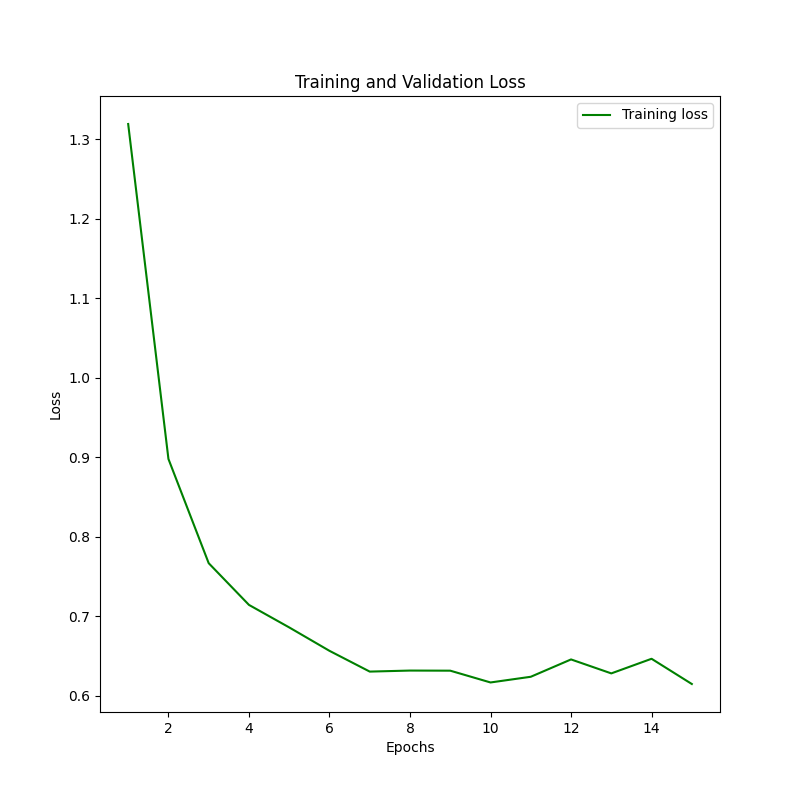
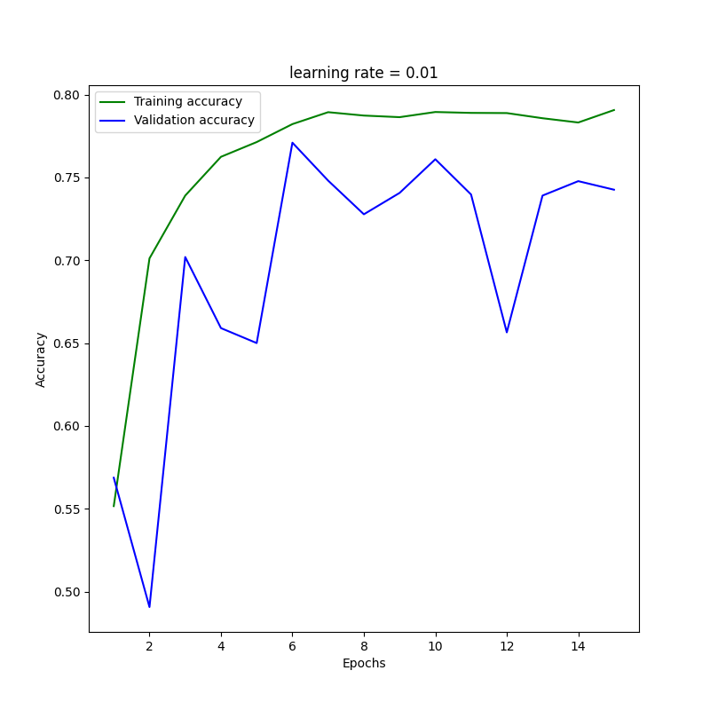
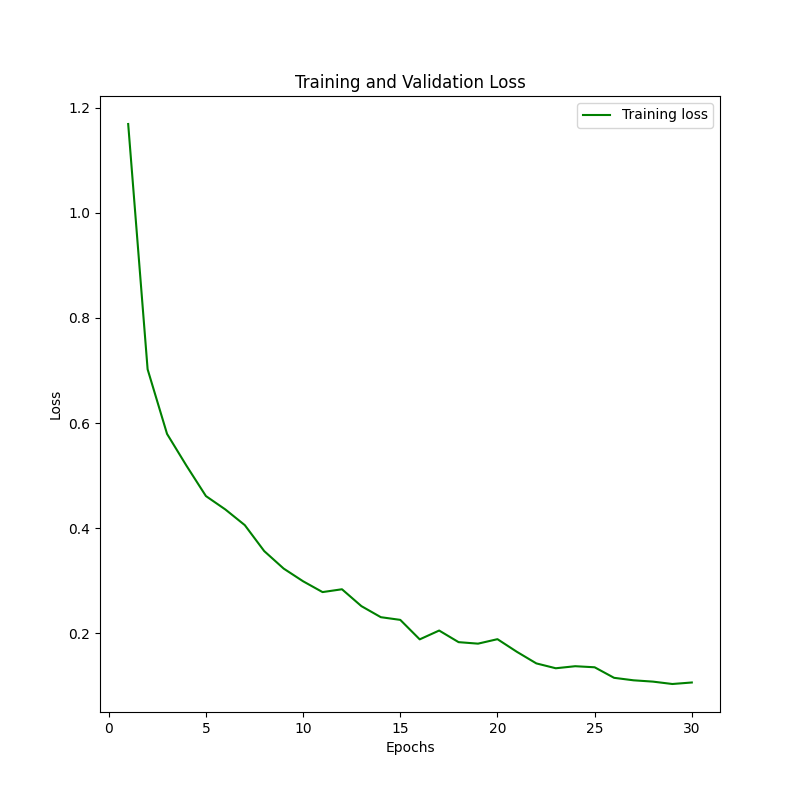
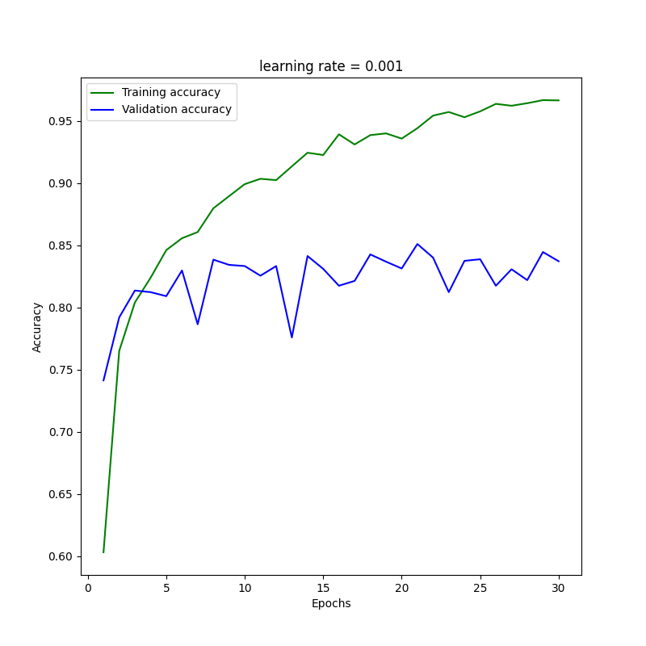
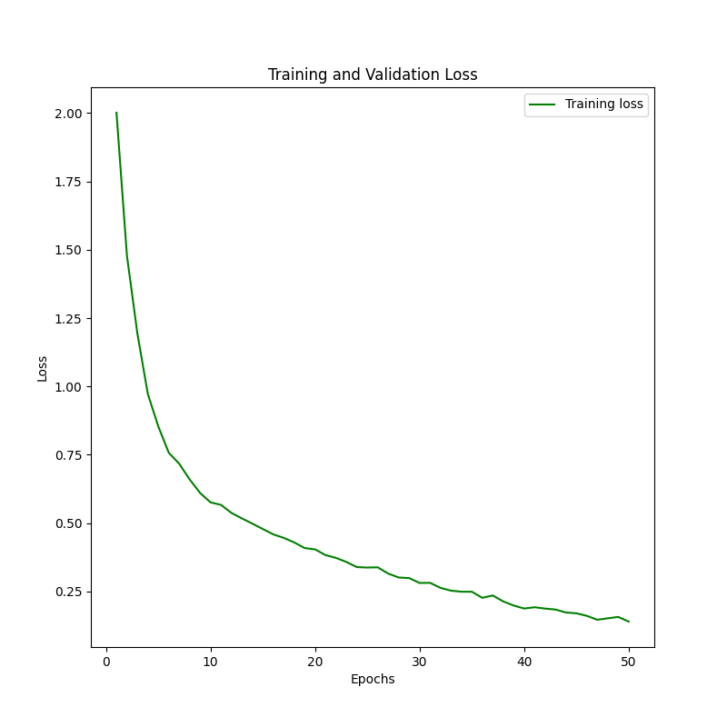
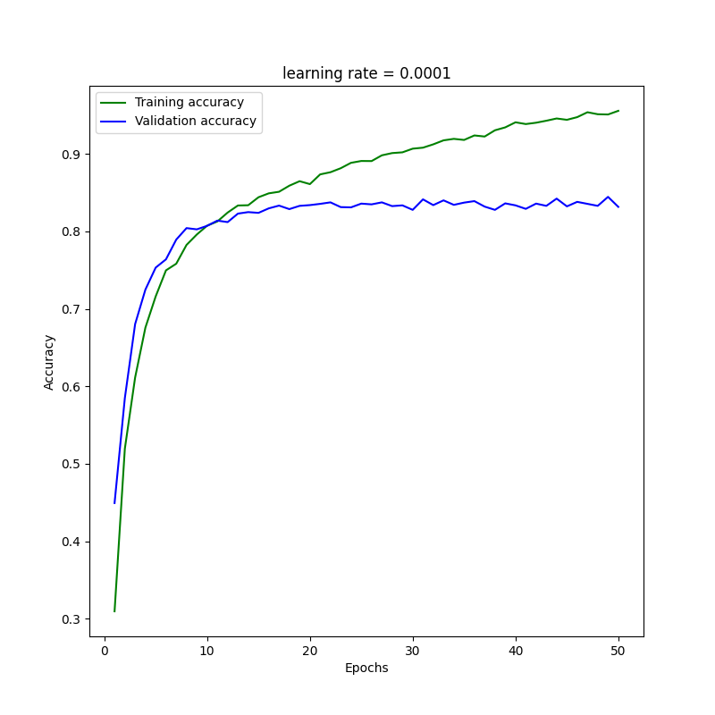

# Galaxies classification using CNN
Machine Learning project for the 2020/21 A.A. exam

## Notes :notebook:
- I haven't yet figured out how to plot the validation loss.
- Best accuracy so far: *84.60%*.
- Testing different batches' size.
- Implemented a [scheduler](https://pytorch.org/docs/stable/_modules/torch/optim/lr_scheduler.html#CosineAnnealingLR) on the optimizer.
- Implemented WeightedRandomSampler in order to balance the classes.
- Working on the stratification of the data split.

## Charts :chart_with_upwards_trend:
### Loss & Accuracy
- Results using ResNet50 and applying some basic transformations

#### lr = 0.01  |  15 EPOCHS 

  
  

#### lr = 0.001  |  30 EPOCHS 

  
  

#### lr = 0.0001  |  50 EPOCHS 

  
  

