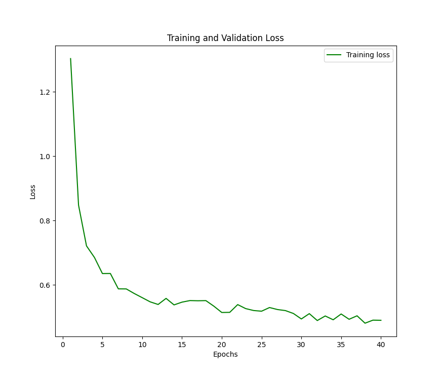

# Galaxies classification using CNN
Machine Learning project for the 2020/21 A.A. exam

## Issues :red_circle:
- I haven't yet figured out how to plot the validation loss
- Validation accuracy: model overfits, lowering the learning rate from 0.01 to 0.005 provided a 80.87% success rate.

## Charts :chart_with_upwards_trend:
### Loss & Accuracy
- Results* using ResNet50 and applying some basic transformations

  
  

*old results (lr = 0.01)
