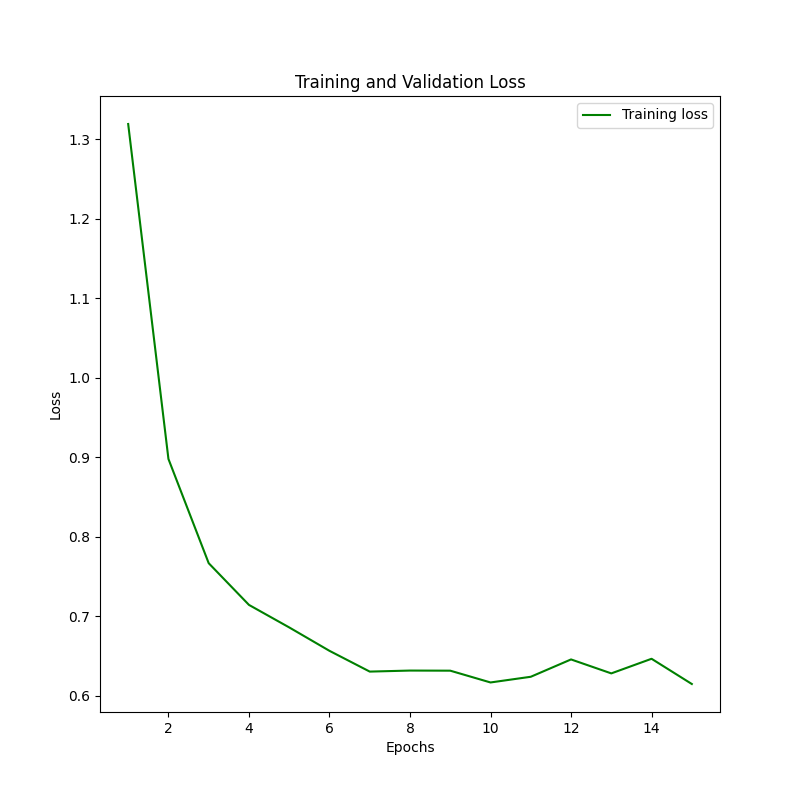
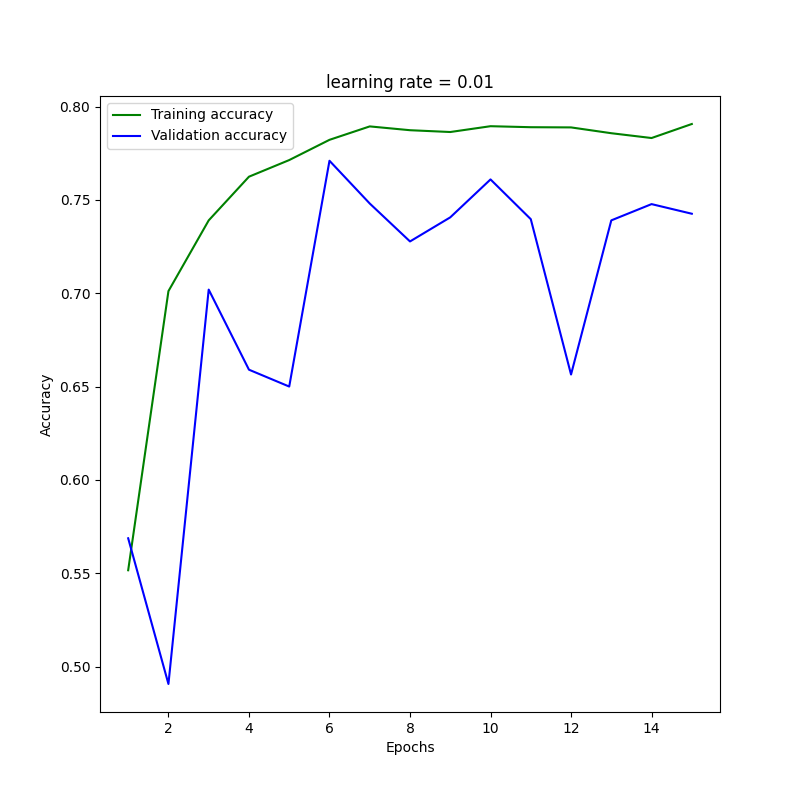
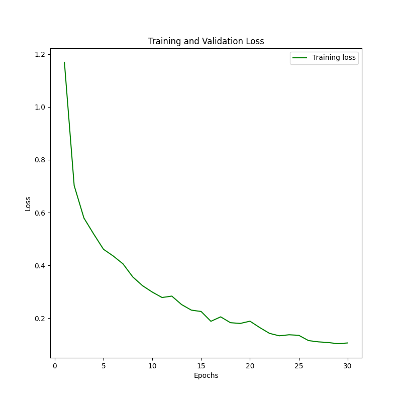
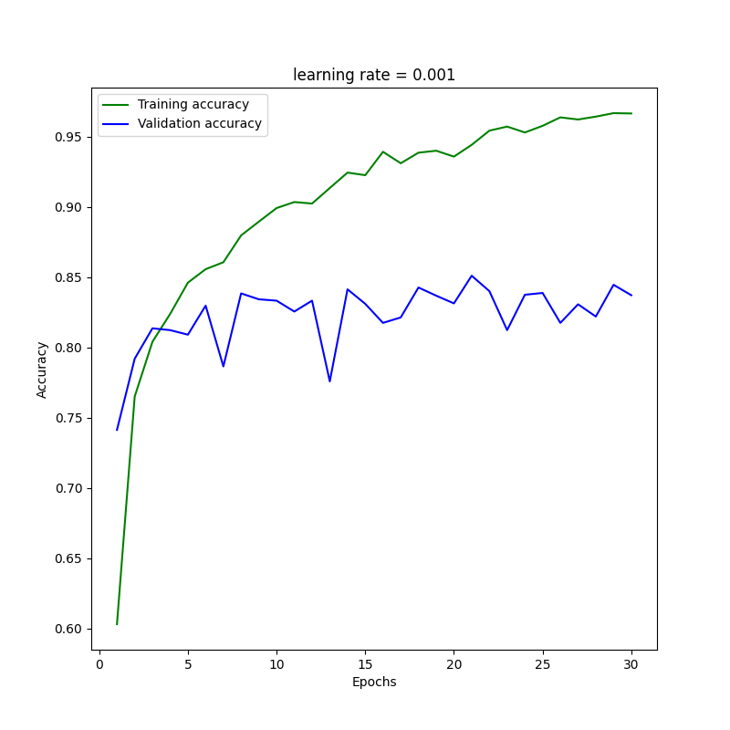
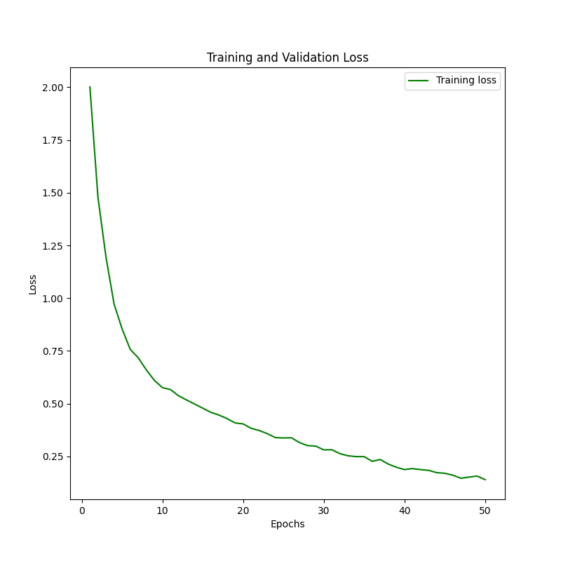
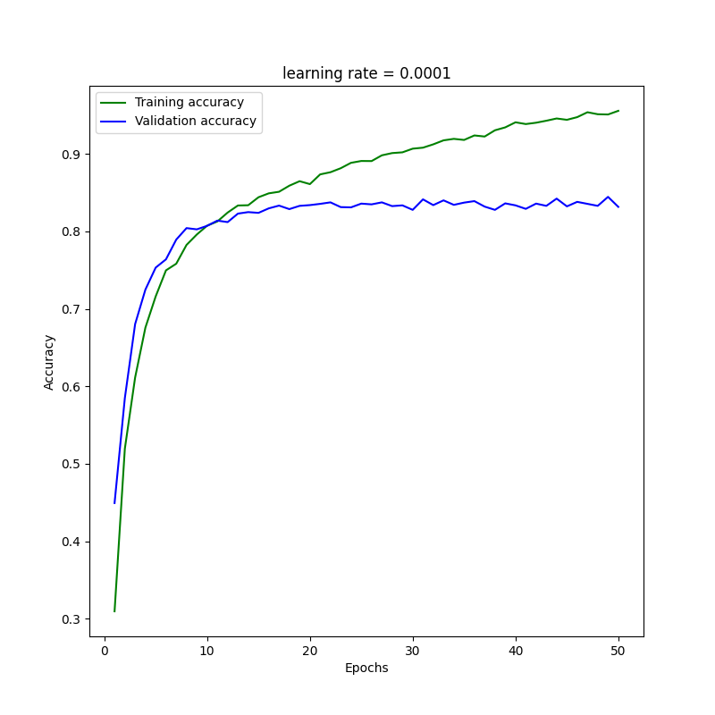

# Galaxies classification using CNN
Machine Learning project for the 2020/21 A.A. exam

## Issues :red_circle:
- I haven't yet figured out how to plot the validation loss.
- Model overfits slightly, lowering the learning rate produced an *85.09%* success rate.
- Testing different batches' size.
- Currently implementing a [scheduler](https://pytorch.org/docs/stable/optim.html) on the optimizer in order to reduce the lr once model is in a plateau.

## Charts :chart_with_upwards_trend:
### Loss & Accuracy
- Results using ResNet50 and applying some basic transformations

#### lr = 0.01  |  15 EPOCHS 

  
  

#### lr = 0.001  |  30 EPOCHS 

  
  

#### lr = 0.0001  |  50 EPOCHS 

  
  

